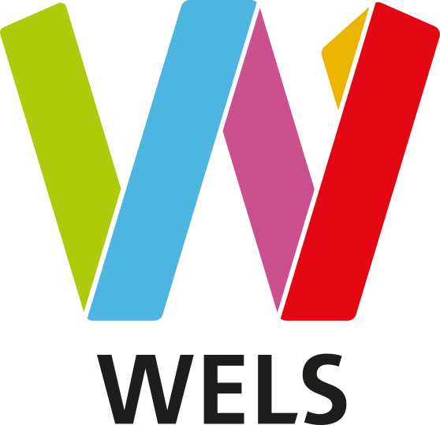

# Team Wels – Bürgerbeteiligungs-System 🏛️

<p align="center">
  
</p>

<p align="center">
  <strong>Digitale Bürgerpartizipation für die Stadt Wels</strong><br/>
  Ein modernes Feedback-Management-System für Lob, Beschwerden und Anliegen von Bürgern
</p>

---

## 🌐 Live Demo

**👉 [Live Website](https://benediktlehner.github.io/Team-Wels-ITPProjekt)**

**📊 [Projekt-Dokumentation (Präsentation)](https://benediktlehner.github.io/Team-Wels-ITPProjekt/revealjs)**

**📋 [Miro-Board (Projektplanung)](https://miro.com/app/board/uXjVJ5z-XVY=/?share_link_id=979235064816)**

---

## 🎯 Über das Projekt

Das **Team Wels Bürgerbeteiligungs-System** ist eine vollständige Web-Applikation, die es Bürgern ermöglicht, Feedback, Lob und Beschwerden digital an die Stadtverwaltung Wels zu übermitteln.  Das System bietet eine transparente Statusverfolgung, automatisierte Benachrichtigungen und ein umfassendes Verwaltungs-Dashboard für Mitarbeiter.

### ✨ Hauptfeatures

#### Für Bürger 👥
- **Einfache Feedback-Einreichung** per E-Mail oder Telefon
- **Kategorisierung** nach Themen (z.B. Infrastruktur, Umwelt, Verwaltung)
- **Statusverfolgung** in Echtzeit (Offen, In Bearbeitung, Erledigt, Abgelehnt)
- **Automatische Benachrichtigungen** per E-Mail und SMS über Statusänderungen
- **Anonyme oder authentifizierte** Einreichung möglich

#### Für Mitarbeiter 🏢
- **Admin-Dashboard** zur Verwaltung aller Feedbacks
- **Aktivitätsprotokoll** zur Nachverfolgung aller Änderungen
- **Statusmanagement** mit automatischer Benachrichtigung
- **Benutzer- und Benachrichtigungsverwaltung**
- **Filterbare Übersichten** nach Mitarbeiter, Feedback-Typ und Zeitraum

---

## 🏗️ Technologie-Stack

### Backend
| Technologie | Version | Beschreibung |
|------------|---------|--------------|
| **Quarkus** | 3.28.4 | Supersonic Subatomic Java Framework |
| **Java** | 19+ | Programmiersprache |
| **Hibernate ORM Panache** | - | Vereinfachte Datenbankabstraktion |
| **PostgreSQL** | 16 Alpine | Relationale Datenbank |
| **Quarkus Mailer** | - | E-Mail-Versand |
| **Twilio SDK** | - | SMS-Benachrichtigungen |

### Frontend
- **TypeScript** – Typsichere Webentwicklung
- **HTML5 / CSS3** – Modernes Webdesign mit kooperativem Design der Stadt Wels
- **Vanilla JS** – Keine unnötigen Dependencies

### DevOps & Tools
- **Docker & Docker Compose** – Containerisierung
- **Maven** – Build-Management
- **reveal.js** – Präsentations-Framework
- **PlantUML** – Diagrammerstellung
- **GitHub Pages** – Hosting der Präsentation

---

## 🚀 Schnellstart

### Voraussetzungen

- **Docker & Docker Compose**
- **Git**

### 1️⃣ Repository klonen

```bash
git clone https://github.com/BenediktLehner/Team-Wels-ITPProjekt.git
cd Team-Wels-ITPProjekt
```

### 2️⃣ Mit Docker Compose starten

```bash
cd WebApp
docker-compose up -d
```

Das startet:
- **PostgreSQL** auf `localhost:5432`
- **Quarkus Backend** auf `localhost:8080`

### 3️⃣ Frontend öffnen

Öffne `index.html` im Browser oder nutze:
```bash
npx serve . 
```

---

## 📂 Projektstruktur

```
Team-Wels-ITPProjekt/
├── 📄 README.md                           # Diese Datei
├── 🎨 logo.svg                            # Projekt-Logo
├── 🌐 index.html                          # Hauptanwendung
├── 📊 revealjs.html                       # Präsentation
│
├── 🖥️ WebApp/
│   ├── 🐳 docker-compose.yml              # PostgreSQL & Backend Container
│   ├── backend/backend/
│   │   ├── Dockerfile                     # Backend Container Image
│   │   ├── src/main/java/                 # Java Quellcode
│   │   │   └── at/htlleonding/teamwels/
│   │   │       └── entity/                # Entities & Resources
│   │   └── pom.xml                        # Maven Dependencies
│   └── frontend/public/                   # Frontend-Dateien
│
├── 📚 Projekt-Doku/                       # Dokumentation
├── 📐 plantUML/                           # ERD und Diagramme
└── 📝 How to work.txt                     # Team-Guidelines
```

---

## 🗄️ Datenmodell

Das System basiert auf folgenden Hauptentitäten:

| Entität | Beschreibung |
|---------|--------------|
| **Benutzer** | Bürger, die Feedback einreichen (E-Mail oder Telefon) |
| **Feedback** | Eingereichte Anliegen mit Betreff, Beschreibung und Status |
| **Mitarbeiter** | Stadtverwaltungsmitarbeiter mit Login und Admin-Rechten |
| **Notification** | E-Mail- und SMS-Benachrichtigungen an Benutzer |
| **ActivityLog** | Protokollierung aller Änderungen und Aktionen |
| **Thema** | Oberkategorien (z.B. Verkehr, Umwelt) |
| **Kategorie** | Detailkategorien für Feedbacks |
| **Status** | Bearbeitungsstatus (OFFEN, IN_BEARBEITUNG, ERLEDIGT, ABGELEHNT) |

📊 **Entity-Relationship-Diagramm:** Siehe `plantUML/ERD.puml`

---

## 🔌 REST-API

### Hauptendpunkte

**Feedback**
- `GET/POST /api/feedback` – Feedbacks abrufen/erstellen
- `PUT/PATCH /api/feedback/{id}` – Feedback aktualisieren/Status ändern

**Benutzer**
- `GET /api/benutzer/mail/{mail}` – Benutzer per E-Mail finden
- `GET /api/benutzer/tel/{tel}` – Benutzer per Telefon finden

**Benachrichtigungen**
- `GET /api/notifications` – Alle Benachrichtigungen
- `GET /api/notifications/ungelesen` – Ungelesene Benachrichtigungen

**Mitarbeiter & Auth**
- `POST /api/auth/login` – Mitarbeiter-Login

**Aktivitätsprotokolle**
- `GET /api/activitylog` – Alle Logs mit optionalen Filtern

---

## 👥 Team

**Projektleiter:**
- **Benedikt Lehner** ([@BenediktLehner](https://github.com/BenediktLehner))

**Entwickler-Team:**
- **Jakob Peneder** ([@jakobpeneder](https://github.com/jakobpeneder))
- **Simon Dokter** ([@simondokter](https://github.com/simondokter))
- **Fabio Neundlinger** ([@NFFabio](https://github.com/NFFabio))

---

## 📚 Weitere Ressourcen

- **Quarkus:** [https://quarkus.io/](https://quarkus.io/)
- **PostgreSQL:** [https://www.postgresql.org/](https://www.postgresql.org/)
- **Reveal.js:** [https://revealjs.com/](https://revealjs.com/)

---

<p align="center">
  Entwickelt mit ❤️ von <strong>Team Wels</strong> für eine digitale Zukunft der Bürgerbeteiligung
</p>